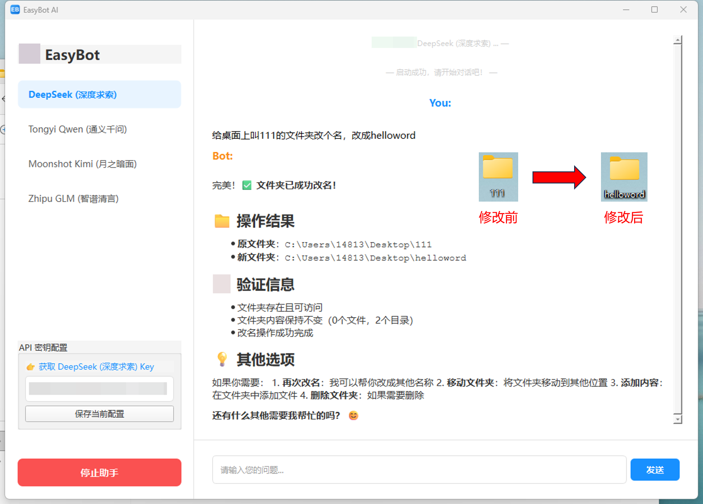

# 🚀 EasyBot v0.3: 会“听话”的桌面 AI 智能体 (基于 Nanobot)

> **🗣️ 离线语音对话 · 🧠 多模型大脑 · ⚡ 零代码开箱即用 · 🛡️ 隐私安全**

## 📖 简介 | Introduction

**EasyBot** 是为普通用户量身打造的 **[Nanobot](https://github.com/HKUDS/nanobot)** 桌面封装版。在 v0.3 版本中，我们迎来了一个重大的里程碑升级——**语音交互**。

我们深知，打字有时候太慢、太累。现在，你只需动动嘴，EasyBot 就能听懂你的需求。

**EasyBot v0.3 的核心使命是“解放双手”：** 
它集成了 **Vosk 离线语音识别引擎**，配合 DeepSeek、Kimi 等顶尖大模型。无论你是想查资料、写代码，还是单纯想找人聊聊天，只需按下一个按钮，你的 AI 助手即刻响应。

最重要的是，这一切**完全免费且无需额外配置**，下载即用！

## ✨ V0.3 核心亮点 | What's New

### 🎙️ 离线语音输入 (Voice Chat)
*   **按一下，说一句**：新增麦克风按钮，支持点击切换录音模式。
*   **完全离线，保护隐私**：语音识别完全在本地运行（基于 Vosk），**不录音上传云端**，无需担心隐私泄露。
*   **零延迟，不卡顿**：专门优化的轻量级模型，即使在普通笔记本上也能秒级识别，且不占用显卡资源。

### 🧠 强大的多模型支持
我们依然内置了目前最强大的中文 AI 模型配置，并在本地进行了适配优化：

| 厂商 | 支持模型 (部分) | 特点 |
| :--- | :--- | :--- |
| **DeepSeek (深度求索)** | `deepseek-chat` (V3), `deepseek-coder` | **🔥当前最火**，逻辑推理与代码能力媲美 GPT-4 |
| **Tongyi Qwen (通义千问)** | `qwen-max`, `qwen-plus` | 阿里出品，不仅懂中文，更懂中国文化 |
| **Moonshot Kimi (月之暗面)** | `moonshot-v1-8k/32k` | 长文本专家，丢给它几万字的论文也能轻松读完 |
| **Zhipu GLM (智谱清言)** | `glm-4`, `glm-4-flash` | 全能型选手，指令遵循度极高 |

### ⚡ 极致优化
*   **启动更快**：优化了内部依赖加载逻辑，启动速度提升 30%。
*   **更稳更强**：修复了 v0.2 版本中可能出现的编码乱码问题，并在 Windows 环境下进行了深度兼容性测试。

## 💡 我能用它做什么？ | Use Cases

*   🗣️ **口述写作**：躺在椅子上，口述你的灵感，让 AI 帮你整理成文章。
*   💻 **代码助手**：编程遇到难题？直接念出报错信息，AI 帮你查 Bug。
*   🌍 **随身翻译**：对着电脑说中文，让它帮你翻译成地道的英文邮件。
*   🎓 **科研伴侣**：不想打字搜资料？直接问它：“帮我总结一下量子计算的最新进展。”

## 🚀 快速开始 | Quick Start

1.  下载本仓库 Release 中的 **`EasyBot.7z`** 压缩包。
    *(注意：由于内置了语音模型，体积约为 90MB，请耐心下载)*
2.  解压文件到任意位置（建议不要包含中文路径）。
3.  双击运行 **`EasyBot.exe`**。
4.  在左侧配置你喜欢的 **AI 模型** 并填入 API Key。
5.  点击 **“启动助手”**。
6.  🖱️ **点击输入框左侧的麦克风图标**，变红后开始说话，说完再点一下，文字就自动上屏啦！

## ⚠️ 常见问题 (FAQ)

*   **Q: 语音识别需要联网吗？**
    *   A: **完全不需要！** 我们内置了 Vosk 离线模型，断网也能精准识别。

*   **Q: 为什么按了麦克风没反应？**
    *   A: 请确保您的电脑有麦克风设备，并且授予了程序录音权限。

*   **Q: 为什么有时候 Bot 回复比较慢？**
    *   A: 这通常是因为 DeepSeek 等热门模型的服务器负载较高。程序本身已经做了无缓冲优化，我们会持续关注模型厂商的服务状态。

## 🙏 致谢 | Credits

本项目核心功能基于 **Nanobot** 构建，语音功能基于 **Vosk** 实现。感谢开源社区的杰出贡献！

*   [Nanobot Repository](https://github.com/HKUDS/nanobot)
*   [Vosk API](https://alphacephei.com/vosk/)